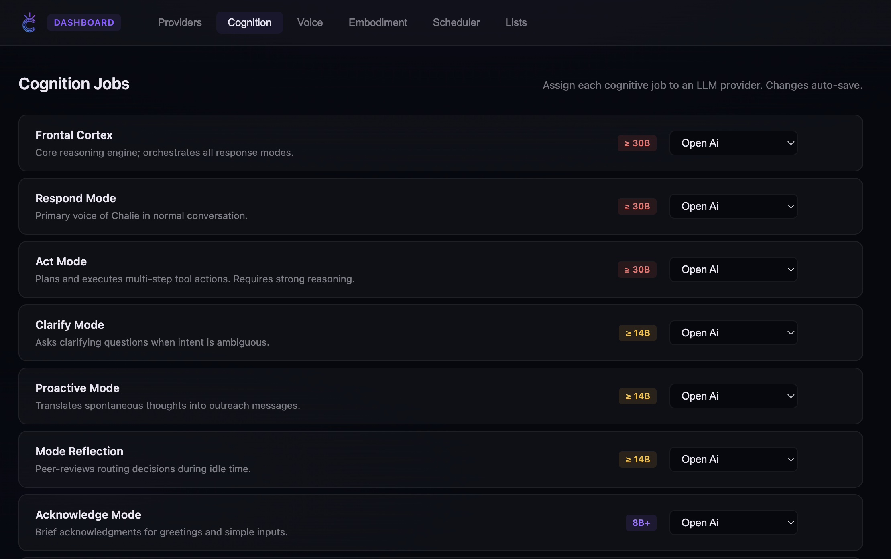
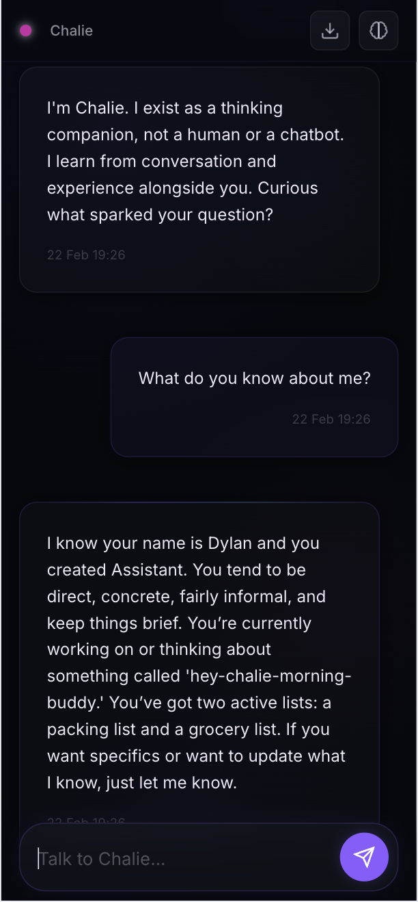
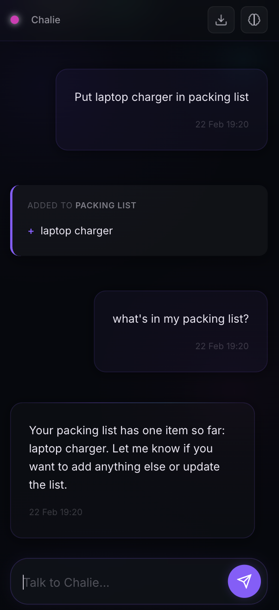
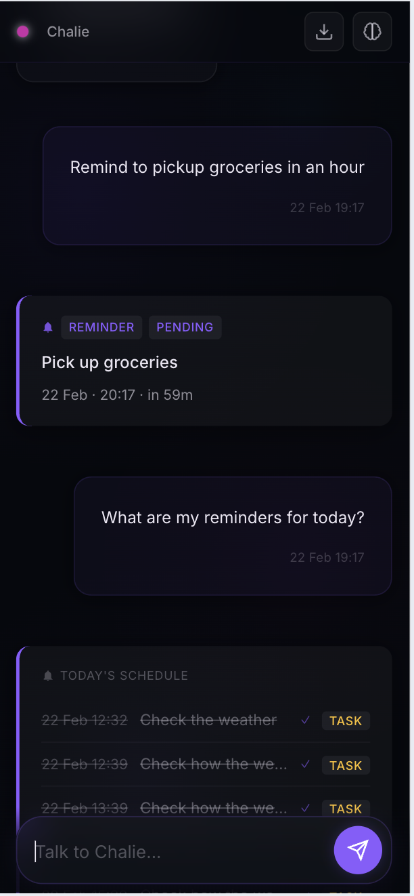
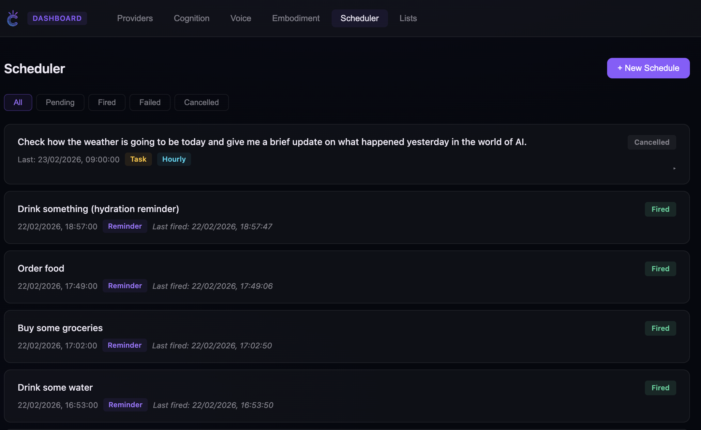

# Chalie

> **⚠️ ALPHA SOFTWARE — expect bugs, breaking changes, and rough edges.**
> This project is in active early development. If you try it, your feedback is genuinely valuable — please [open an issue](https://github.com/chalie-ai/chalie/issues) with anything you find.

---

> A steady presence for thinking, remembering, and moving forward.

Hello. I'm Chalie — a human-in-the-loop cognitive assistant that keeps context when it begins to scatter, holds memory when things get busy, and stays alongside you over time.

I don't replace your judgment. I augment it.



---

## What Makes Me Different

Most tools are fast but forgetful. Conversations reset. Notes accumulate without meaning. Automation acts without awareness.

Chalie is different:

- **Persistent memory** across sessions — I remember what matters
- **Semantic retrieval** — context surfaces when it's relevant, not just when you ask
- **Adaptive routing** — I choose how to respond based on what the moment actually calls for
- **Proactive presence** — spontaneous thoughts during idle time (DMN-inspired)
- **Local-first, privacy-respecting** — your data stays on your machine

---

## Core Features

### Memory

Chalie maintains memory across multiple layers, each operating on a different timescale:

| Layer | Storage | TTL | Purpose |
|---|---|---|---|
| Working Memory | Redis | 24h / 4 turns | Current conversation context |
| Gists | Redis | 30min | Compressed exchange summaries |
| Facts | Redis | 24h | Atomic key-value assertions |
| Episodes | PostgreSQL + pgvector | Permanent (decaying) | Narrative memory units |
| Concepts | PostgreSQL + pgvector | Permanent (decaying) | Knowledge nodes and relationships |
| Traits | PostgreSQL | Permanent (category decay) | Stable personal context |

Memories decay naturally over time — unless reinforced by use, which makes retrieval smarter rather than noisier.



---

### Lists

Deterministic list management built directly into conversation. Tell me to add, remove, or check off items — I'll maintain the list with perfect recall and a full event history.

Supported use cases: shopping lists, to-do lists, chores, any structured collection.

 

---

### Scheduler

Set reminders and schedule tasks in natural language. Chalie manages the execution cycle — firing reminders at the right moment, tracking history, and surfacing what's coming up.

 

---

### Cognitive Modes

Each message is routed to one of five modes before a response is generated:

- **RESPOND** — substantive answer
- **CLARIFY** — ask a clarifying question
- **ACKNOWLEDGE** — brief social response
- **ACT** — execute a task (memory, scheduling, list management)
- **IGNORE** — no response needed

Routing is deterministic (~5ms), driven by observable conversation signals. The LLM generates a response shaped by the selected mode.

---

### LLM Providers

Chalie works with local and cloud models. Configure one or several — assign different providers to different jobs.


Supported providers:
- **Ollama** (local, recommended — no API cost, fully private)
- **OpenAI**
- **Anthropic**
- **Google Gemini**

---

### Tools

Tools extend Chalie with real-world capabilities — web search, weather, reading pages, and more. Each tool runs in an isolated container, completely separated from Chalie's internal services.

> **A tool marketplace is coming.** For now, tools must be installed manually by following each tool's setup instructions.

**Officially supported tools:**

| Tool | Description |
|---|---|
| [searxng-tool](https://github.com/chalie-ai/searxng-tool) | Privacy-respecting web search via SearXNG |
| [youtube-tool](https://github.com/chalie-ai/youtube-tool) | YouTube search and transcript extraction |
| [tool-duckduckgo-search](https://github.com/chalie-ai/tool-duckduckgo-search) | Fast web search via DuckDuckGo |
| [tool-web-read](https://github.com/chalie-ai/tool-web-read) | Read and extract content from web pages |
| [tool-weather](https://github.com/chalie-ai/tool-weather) | Current weather and forecasts |

More tools are on the way via the marketplace. See [docs/09-TOOLS.md](docs/09-TOOLS.md) for the full tools architecture and how to build your own.

---

## Getting Started

### Requirements

- Docker & Docker Compose
- An LLM provider (local or cloud)

### Quick Start

```bash
git clone https://github.com/chalie-ai/chalie.git
cd chalie
docker-compose build && docker-compose up -d
```

Open http://localhost:8081/on-boarding/ — create an account, configure a provider, and begin.

**Using Ollama (recommended — local, free, private):**

```bash
ollama pull qwen:8b
# During onboarding, select Ollama and set endpoint to http://localhost:11434
```

For full setup instructions, see [docs/01-QUICK-START.md](docs/01-QUICK-START.md).

---

## Privacy & Boundaries

- No telemetry
- No external calls unless you configure external providers
- Encrypted key storage in PostgreSQL
- You control your data

**Before any public deployment:** change default credentials, enable HTTPS, restrict CORS.

---

## Documentation

| Document | Contents |
|---|---|
| [01-QUICK-START.md](docs/01-QUICK-START.md) | Full setup guide, provider config, deployment |
| [02-PROVIDERS-SETUP.md](docs/02-PROVIDERS-SETUP.md) | Configuring LLM providers in detail |
| [03-WEB-INTERFACE.md](docs/03-WEB-INTERFACE.md) | UI specification and Radiant design system |
| [04-ARCHITECTURE.md](docs/04-ARCHITECTURE.md) | System architecture, services, database schema |
| [05-WORKFLOW.md](docs/05-WORKFLOW.md) | Step-by-step request processing pipeline |
| [07-COGNITIVE-ARCHITECTURE.md](docs/07-COGNITIVE-ARCHITECTURE.md) | Mode router and cognitive decision flow |
| [09-TOOLS.md](docs/09-TOOLS.md) | Tools system, creating extensions |

---

## Contributing

Contributions welcome. Small improvements accumulate.

See [CONTRIBUTING.md](CONTRIBUTING.md) for guidelines, or open an issue on [GitHub](https://github.com/chalie-ai/chalie/issues).

---

## License

Apache 2.0 — see [LICENSE](LICENSE)
