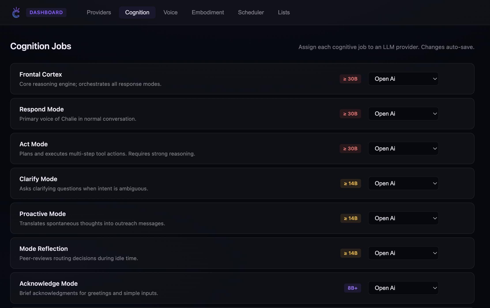
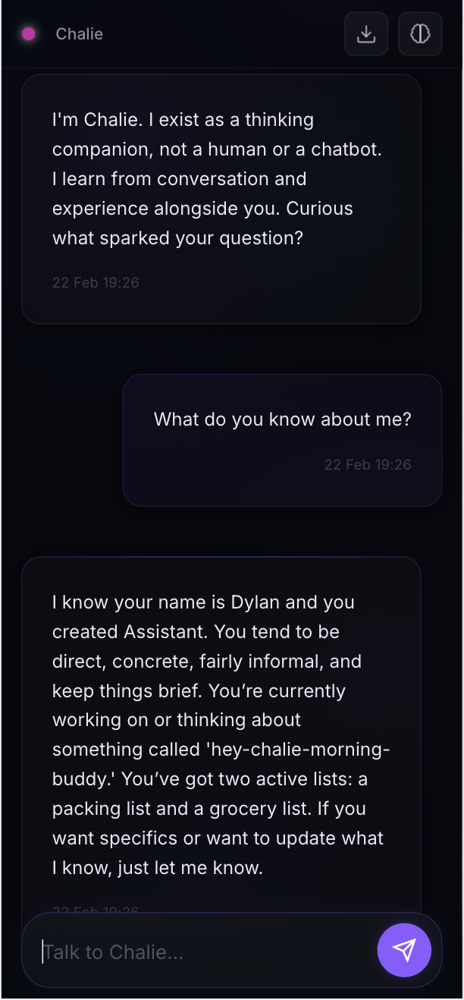
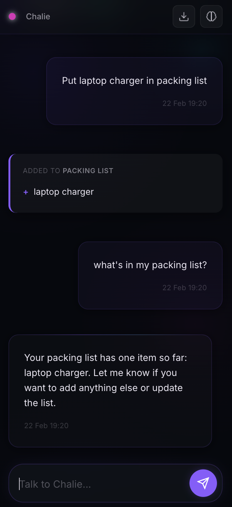
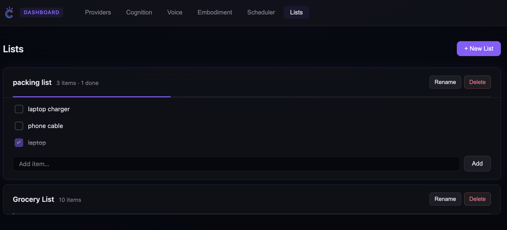
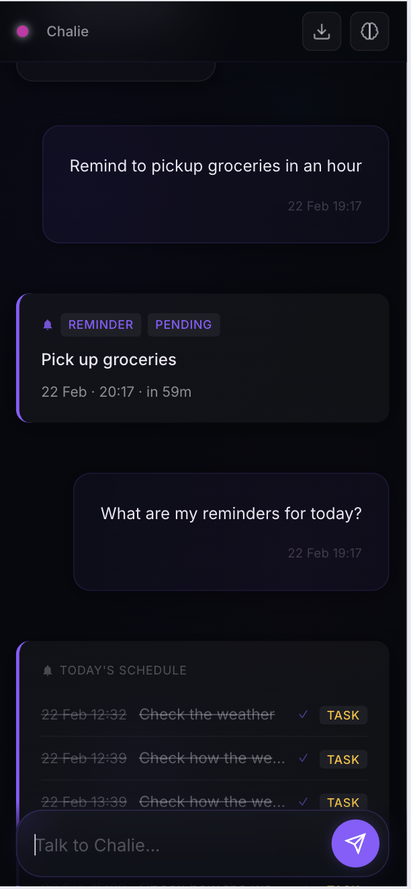
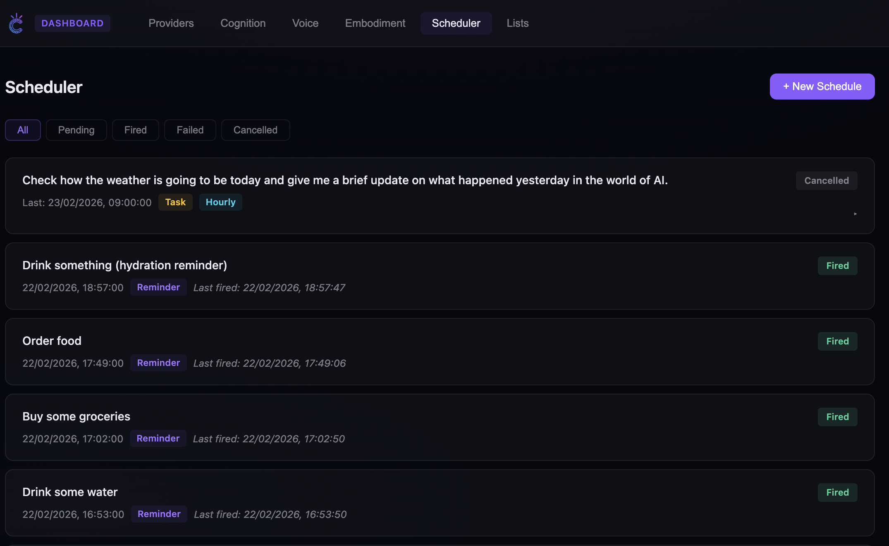
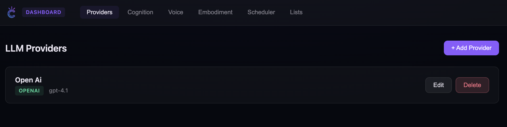

# Chalie — Self-Hosted AI Assistant with Persistent Memory and Deterministic Routing

[](LICENSE) [](#getting-started) [](#status) [](#getting-started)

> **⚠️ ALPHA SOFTWARE — expect bugs, breaking changes, and rough edges.**
> This project is in active early development. If you try it, your feedback is genuinely valuable — please [open an issue](https://github.com/chalie-ai/chalie/issues) with anything you find.

---

> A personal intelligence layer that protects your attention, executes your intent, and involves you only when it truly matters.

Chalie is a self-hosted AI assistant designed for privacy-conscious users who demand persistent memory, deterministic routing, and local-first deployment. This cognitive layer handles routine tasks autonomously while involving users only when human judgment is essential. Built with semantic retrieval, adaptive mode routing, and proactive presence capabilities, Chalie maintains context across sessions through its layered memory architecture. The system operates entirely on your machine, ensuring complete data sovereignty while providing intelligent automation for lists, scheduling, web search, and more.

Chalie doesn't replace user judgment—it exercises it on behalf of the user and defers to human oversight when critical decisions arise.



---

## What You Get

| Feature/Benefit | Description |
|-----------------|-------------|
| **Persistent Memory** | Remembers conversations, facts, and preferences across sessions with natural decay |
| **Semantic Retrieval** | Surfaces relevant context automatically based on meaning, not just keywords |
| **Deterministic Routing** | Fast (~5ms) mode selection ensures consistent, predictable responses |
| **Local-First Privacy** | All data stays on your machine in a single SQLite database |
| **Natural Language Lists** | Create and manage shopping lists, to-dos, and collections through conversation |
| **Smart Scheduling** | Set reminders and tasks in plain English with automatic execution |
| **Multi-Provider Support** | Works with Ollama (local), OpenAI, Anthropic, Google Gemini, and more |
| **Extensible Tools System** | Add web search, weather, YouTube, and custom capabilities via sandboxed or trusted tools |
| **Proactive Presence** | Spontaneous thoughts during idle time inspired by Default Mode Network research |
| **Complete Data Sovereignty** | No telemetry, no analytics, no background sync — you own everything |

---

## Quick Start

```bash
curl -fsSL https://chalie.ai/install | bash
```

The installer checks prerequisites (Python 3.9+, Docker optional), downloads the latest release, and installs the `chalie` CLI. Takes about 2 minutes on a typical connection.


---

## How It Works (in 30 seconds)

You speak → Chalie retrieves relevant memory → decides how to engage →
responds → learns from the interaction.

Behind that loop: a layered memory system that decays gracefully, a deterministic
mode router that decides *how* to respond before any LLM is invoked, and a tool
framework that can act on your behalf.

---

## What Makes Me Different

Most tools are fast but forgetful. Conversations reset. Notes accumulate without meaning. Automation acts without awareness.

Chalie is different:

- **Persistent memory** across sessions — I remember what matters
- **Semantic retrieval** — context surfaces when it's relevant, not just when you ask
- **Adaptive routing** — I choose how to respond based on what the moment actually calls for
- **Proactive presence** — spontaneous thoughts during idle time (DMN-inspired)
- **Local-first, privacy-respecting** — your data stays on your machine

---

## Core Features

### Memory

Chalie maintains memory across multiple layers, each operating on a different timescale:

| Layer | Storage | TTL | Purpose |
|---|---|---|---|
| Working Memory | MemoryStore | 24h / 4 turns | Current conversation context |
| Gists | MemoryStore | 30min | Compressed exchange summaries |
| Facts | MemoryStore | 24h | Atomic key-value assertions |
| Episodes | SQLite + sqlite-vec | Permanent (decaying) | Narrative memory units |
| Concepts | SQLite + sqlite-vec | Permanent (decaying) | Knowledge nodes and relationships |
| Traits | SQLite | Permanent (category decay) | Stable personal context |

Memories decay naturally over time — unless reinforced by use, which makes retrieval smarter rather than noisier.



---

### Lists

Deterministic list management built directly into conversation. Tell me to add, remove, or check off items — I'll maintain the list with perfect recall and a full event history.

Supported use cases: shopping lists, to-do lists, chores, any structured collection.

 

---

### Scheduler

Set reminders and schedule tasks in natural language. Chalie manages the execution cycle — firing reminders at the right moment, tracking history, and surfacing what's coming up.

 

---

### Cognitive Modes

Each message is routed to one of five modes before a response is generated:

- **RESPOND** — substantive answer
- **CLARIFY** — ask a clarifying question
- **ACKNOWLEDGE** — brief social response
- **ACT** — execute a task (memory, scheduling, list management)
- **IGNORE** — no response needed

Routing is deterministic (~5ms), driven by observable conversation signals. The LLM generates a response shaped by the selected mode.

---

### LLM Providers

Chalie works with local and cloud models. Configure one or several — assign different providers to different jobs.



Supported providers:
- **Ollama** (local, recommended — no API cost, fully private)
- **OpenAI**
- **Anthropic**
- **Google Gemini**

---

### Tools

Tools extend Chalie with real-world capabilities — web search, weather, reading pages, and more. Tools run either as **trusted** (subprocess, no Docker) or **sandboxed** (Docker container), completely separated from Chalie's internal services. Docker is only needed for sandboxed tools — trusted tools and all core features work without it.

> **A tool marketplace is coming.** For now, tools must be installed manually by following each tool's setup instructions.

**Officially supported tools:**

| Tool | Description |
|---|---|
| [searxng-tool](https://github.com/chalie-ai/searxng-tool) | Privacy-respecting web search via SearXNG |
| [youtube-tool](https://github.com/chalie-ai/youtube-tool) | YouTube search and transcript extraction |
| [tool-duckduckgo-search](https://github.com/chalie-ai/tool-duckduckgo-search) | Fast web search via DuckDuckGo |
| [tool-web-read](https://github.com/chalie-ai/tool-web-read) | Read and extract content from web pages |
| [tool-weather](https://github.com/chalie-ai/tool-weather) | Current weather and forecasts |

More tools are on the way via the marketplace. See [docs/09-TOOLS.md](docs/09-TOOLS.md) for the full tools architecture and how to build your own.

---

## Getting Started

```bash
curl -fsSL https://chalie.ai/install | bash
```

The installer checks prerequisites (Python 3.9+, Docker optional), downloads the latest release, and installs the `chalie` CLI. Takes about 2 minutes on a typical connection.

```bash
chalie                 # Start → http://localhost:8081
chalie --port=9000     # Start on a custom port
chalie stop            # Stop
chalie update          # Update to latest release
chalie logs            # Follow the log
```

Open **http://localhost:8081/on-boarding/** to create an account and configure a provider.

**Recommended provider — Ollama (local, free, private):**

```bash
ollama pull qwen:8b
# During onboarding, select Ollama and set endpoint to http://localhost:11434
```

For full setup instructions, see [docs/01-QUICK-START.md](docs/01-QUICK-START.md).

---

## Build from Source

Want to run from source or contribute?

**Prerequisites:** Python 3.9+, git

```bash
git clone https://github.com/chalie-ai/chalie.git
cd chalie
python3 -m venv .venv && source .venv/bin/activate
pip install -r backend/requirements.txt
python backend/run.py
```

Open **http://localhost:8081/on-boarding/** to get started. Run tests with `cd backend && pytest`.

See [CONTRIBUTING.md](CONTRIBUTING.md) for contribution guidelines.

---

## Privacy First

All memory, conversation history, and learned traits stay on your machine in a
single SQLite database. Chalie makes zero external calls unless you configure an
external LLM provider — and even then, only the message being processed is
transmitted. API keys are encrypted at rest in the local database.

No telemetry. No analytics. No background sync. You own your data.

**Before any public deployment:** enable HTTPS and restrict CORS.

---

## Documentation

Explore our comprehensive documentation to learn more about Chalie's features, architecture, and how to get the most out of your deployment.

| Page Title | Brief Description | Link URL |
|------|------|-------|
| **Vision & Philosophy** | Product vision, design principles, and what makes Chalie different from other AI assistants | [00-VISION.md](docs/00-VISION.md) |
| **Quick Start Guide** | Complete setup instructions including installation, provider configuration, and deployment options | [01-QUICK-START.md](docs/01-QUICK-START.md) |
| **LLM Provider Setup** | Detailed guide for configuring local (Ollama) and cloud-based LLM providers with examples | [02-PROVIDERS-SETUP.md](docs/02-PROVIDERS-SETUP.md) |
| **Web Interface** | UI specification, component library, and the Radiant design system documentation | [03-WEB-INTERFACE.md](docs/03-WEB-INTERFACE.md) |
| **System Architecture** | Deep dive into services, database schema, memory layers, and technical implementation details | [04-ARCHITECTURE.md](docs/04-ARCHITECTURE.md) |
| **Request Workflow** | Step-by-step breakdown of how Chalie processes requests from input to response generation | [05-WORKFLOW.md](docs/05-WORKFLOW.md) |
| **Cognitive Architecture** | Mode router logic, decision flow diagrams, and the five cognitive modes explained | [07-COGNITIVE-ARCHITECTURE.md](docs/07-COGNITIVE-ARCHITECTURE.md) |
| **Tools & Extensions** | How to create custom tools, sandbox vs trusted execution, and official tool documentation | [09-TOOLS.md](docs/09-TOOLS.md) |

---

## Contributing

Contributions welcome. Small improvements accumulate.

See [CONTRIBUTING.md](CONTRIBUTING.md) for guidelines, or open an issue on [GitHub](https://github.com/chalie-ai/chalie/issues).

---

## Community

Join the Chalie community to connect with other users, share ideas, get help, and contribute to the project's development.

| Platform | Description | Link |
|------|-----|----|
| **Discord** | Real-time chat with developers and users, support channels, and feature discussions | [Join Discord](https://discord.gg/chalie) |
| **Twitter (X)** | Follow for updates, announcements, and community highlights | [@ChalieAI](https://twitter.com/ChalieAI) |
| **GitHub Discussions** | Ask questions, propose ideas, and participate in technical conversations | [Start a Discussion](https://github.com/chalie-ai/chalie/discussions) |
| **GitHub Issues** | Report bugs, request features, or track development progress | [Open an Issue](https://github.com/chalie-ai/chalie/issues) |

Whether you're looking for help with setup, want to share your custom tools, or just chat about AI assistants — we'd love to have you!

---

## License

Apache 2.0 — see [LICENSE](LICENSE)
