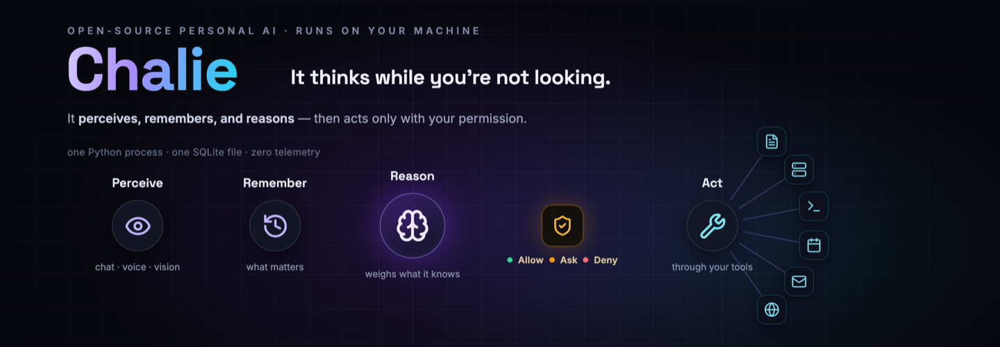
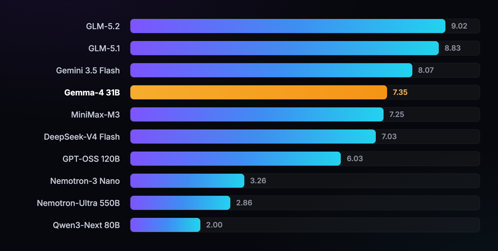

<p align="center">
  
</p>

<h1 align="center">Chalie</h1>

<p align="center">
  <strong>It thinks while you're not looking.</strong><br>
  An open-source personal AI that runs on your own machine — it remembers what matters, works while you're away, and asks before it acts.
</p>

<p align="center">
  <a href="https://github.com/chalie-ai/chalie/tags"></a>
  <a href="LICENSE"></a>
  <a href="https://chalie.ai/blog/2026-06-23-ten-models-one-assistant/"></a>
  <a href="https://chalie.ai/docs"></a>
</p>

<p align="center"><strong>📖 <a href="https://chalie.ai/docs">Full documentation →</a></strong></p>

```bash
curl -fsSL https://chalie.ai/install | bash
chalie     # → http://localhost:31025
```

> **Beta — on purpose.** The bar is software you'd trust with your own life's admin, and it isn't all the way there yet. Hit a sharp edge? [Open an issue](https://github.com/chalie-ai/chalie/issues) — we respond fast.

<p align="center"></p>

## Why Chalie is different

Most AI tools forget you the moment you close the tab. Chalie runs on your own machine as a **reasoning engine that keeps working while you step away**: it remembers what matters and lets the rest decay, and acts only behind an **Allow / Ask / Deny** policy spanning you, its own background work, and other agents. One SQLite file, credentials encrypted at rest, zero telemetry, encrypted whole-instance backup — no Redis, no Postgres, no queue, just one Python process.

## What it can do today

| | |
|---|---|
| 🧠 **Self-managing memory** | Episodes → concepts → abstractions, weighted by source, with decay and automatic roll-up. |
| 🎯 **Goals & proactive research** | Spots goals from casual mentions; researches topics in the background before you ask. |
| 👁 **Vision** | Reads photos, screenshots, and scans — and indexes them so you can find an image by what's in it. |
| 🌐 **Real web browsing** | Drives a live browser: clicks, fills forms, scrolls, and inspects its own screenshots. |
| 🔌 **MCP, in and out** | Connects to remote MCP servers and exposes its own tools to other agents. |
| 📬 **Email, calendar, contacts** | IMAP, CalDAV, CardDAV — the accounts you already have. |
| 🗓 **Scheduler & places** | Natural-language recurring jobs and location-aware nudges. |
| 🧰 **Files, shell & code** | Searches files, runs guarded shell commands, and delegates coding tasks to an agent that writes and runs TypeScript in its own persistent, sandboxed workspace. |
| 🎙 **Voice, fully local** | Moonshine STT + Kokoro TTS, both ONNX. No cloud transcription, ever. |
| 💾 **Backup & restore** | Snapshot the whole instance to one file, optionally AES-256 encrypted. |

## Which model drives it best?

We ran ten models — frontier and open-weight — through the same battery of real tasks and scored how well each *drives* Chalie. A 31B open model you can run under your desk landed in the front pack, ahead of a 550B one. Size wasn't the story; the chassis was. → [Read the benchmark](https://chalie.ai/blog/2026-06-23-ten-models-one-assistant/)

<p align="center"></p>

## Install

**Fastest start** — the wizard picks your provider on first boot:
```bash
curl -fsSL https://chalie.ai/install | bash
chalie     # → http://localhost:31025 · choose OpenAI, Anthropic, Gemini, or Ollama
```

**Fully local with Ollama** — nothing leaves your network:
```bash
ollama pull gemma4:31b   # the open model that placed in the benchmark's front pack
```

**From source:**
```bash
git clone https://github.com/chalie-ai/chalie.git && cd chalie
uv pip install --system -e backend/          # all dependencies, voice (TTS/STT/VAD) included · Python 3.11+
./run.sh  # → http://localhost:31025/on-boarding/
```

Full walkthrough → [chalie.ai/guide/installation](https://chalie.ai/guide/installation).

### Supported systems

| Platform | Status |
|---|---|
| **macOS — Apple Silicon** | Supported. Intel Macs are not: `onnxruntime` no longer publishes wheels for them. |
| **Linux — apt** (amd64/arm64) | Supported. Verified on Debian 12 and Ubuntu 24.04. |
| **Linux — dnf** (amd64/arm64) | Supported. Verified on Fedora 40 and 41. |
| **Anything else** | The installer refuses outright rather than leaving you a half-installed instance. Docker runs anywhere → [installation guide](https://chalie.ai/guide/installation). |

Every supported platform is re-proved on each merge to `main`. [`installer/verify`](installer/verify/) runs the real installer on a pristine machine, boots Chalie, and passes only once readiness, the web interface, Chromium, a Kokoro → Moonshine voice round trip, and Deno all check out.

### System requirements

What the runtime itself needs — a model's own requirements are separate:

| | |
|---|---|
| **Python 3.11+** | Already installed. The installer checks for it and deliberately never installs it, so distributions shipping something older — Ubuntu 22.04 (3.10), AlmaLinux 9 (3.9) — are refused until you supply one. |
| **Root or `sudo`** | Linux only, for the system build packages and the CLI. macOS needs neither. |
| **~2 GB RAM** | Resident set measured at 1.5–1.7 GB once the voice and embedding models have warmed up. Verified on a 4 GB machine; below that is untested. |
| **~3 GB disk** | The Python virtualenv and native wheels, the Chromium build Playwright downloads, the local voice models, and Deno. |
| **Port 31025** | The default; `chalie --port=9000` moves it. |

## How it's built

One Python process. Flask + `flask-sock` WebSocket. SQLite with `sqlite-vec` and FTS5 for semantic + lexical recall. Vanilla ES6 modules on the frontend — no build step. The whole cognitive runtime — memory, goals, scheduler, voice — runs as daemon threads inside that one process, and different cognitive functions can use different models.

Curious? → [Architecture & internals](https://chalie.ai/docs) · [Schema](backend/schema.sql)

## CLI

```bash
chalie                  # start
chalie --port=9000      # custom port
chalie stop             # stop the daemon
chalie update           # update to latest
chalie logs             # tail the log
```

## Philosophy

- **Judgment over activity.** Fewer high-confidence actions beat many low-confidence ones.
- **Restraint builds trust.** Every token, notification, and action earns its place.
- **Continuity is intelligence.** The persistent runtime — not any single response — is the product.
- **Constraints are features.** Decay, capacity limits, and token budgets are what make wisdom emerge.

Full product compass and design rationale live at [chalie.ai/docs](https://chalie.ai/docs).

## Documentation

Full documentation lives at [chalie.ai](https://chalie.ai).

| | |
|---|---|
| 📘 **[Guide](https://chalie.ai/guide)** | Setup, providers, and day-to-day usage. |
| 🏗 **[Docs](https://chalie.ai/docs)** | Technical reference and architecture. |
| 🤝 **[Contributing](https://chalie.ai/contribute)** | How to get involved and ship a PR. |

## Community

[chalie.ai](https://chalie.ai) · [Releases](https://chalie.ai/releases) · [Blog](https://chalie.ai/blog) · [X](https://x.com/chalieai) · [Reddit](https://www.reddit.com/r/ChalieAi/)

## Contributing

PRs welcome. Start with the [contributor handbook](docs/index.md) — vision, principles, and mechanics in one index — or [open an issue](https://github.com/chalie-ai/chalie/issues). Found a security issue? Read [SECURITY.md](docs/SECURITY.md).

## License

[Apache 2.0](LICENSE) — use it, fork it, ship it.
