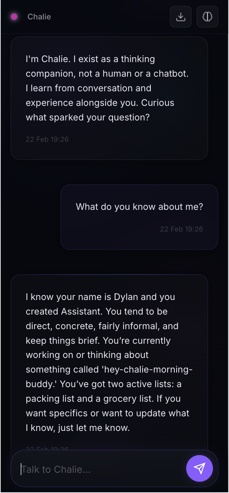

# Chalie

> **⚠️ ALPHA SOFTWARE — expect bugs, breaking changes, and rough edges.**
> Your feedback is genuinely valuable — please [open an issue](https://github.com/chalie-ai/chalie/issues) with anything you find.

**A personal intelligence layer that remembers, reasons, and acts on your behalf — so you can think less about doing.**

```bash
curl -fsSL https://chalie.ai/install | bash
chalie
```

Open **http://localhost:8081**, create an account, pick an LLM provider, and start talking.

---

## Why Chalie?

Most AI tools are fast but forgetful. Conversations reset. Notes pile up. Automation acts without awareness.

Chalie is a **persistent cognitive agent** that runs on your machine. It remembers what matters, forgets what doesn't, and builds understanding over time. Every interaction makes it smarter about *you*.

- **Persistent memory** — context carries forward across sessions and surfaces when relevant
- **Acts on your behalf** — lists, reminders, web search, code execution, external app integrations
- **Thinks on its own** — generates insights during idle time, not just when prompted
- **Fully private** — single local database, zero telemetry, zero analytics



---

## Getting Started

**CLI basics:**
```bash
chalie                 # Start → http://localhost:8081
chalie --port=9000     # Custom port
chalie stop            # Stop
chalie update          # Update to latest
chalie logs            # Follow the log
```

**Local model (free, fully private):**
```bash
ollama pull qwen:8b
# During onboarding, select Ollama → http://localhost:11434
```

Also works with **OpenAI**, **Anthropic**, and **Google Gemini**. See [Quick Start](docs/01-QUICK-START.md) for full details.

---

## Built-in Tools

Chalie picks and uses tools on its own when needed:

| Tool | What it does |
|---|---|
| Weather | Current conditions and forecasts (no API key needed) |
| Web Search | Privacy-focused search via DuckDuckGo |
| Code Eval | Run Python snippets in a sandbox |
| Docs Search | Official docs for 12 languages and 11 frameworks |

External apps can also pair with Chalie and expose their own capabilities. See [Interfaces](docs/15-INTERFACES.md).

---

## Build from Source

```bash
git clone https://github.com/chalie-ai/chalie.git
cd chalie
python3 -m venv .venv && source .venv/bin/activate
pip install -r backend/requirements.txt
python backend/run.py
```

Open **http://localhost:8081/on-boarding/** to get started. Run tests with `cd backend && pytest`.

---

## Privacy

All data stays on your machine in a single SQLite database. Chalie makes zero external calls unless you configure an external LLM provider — and even then, only the current message is transmitted. API keys are encrypted at rest. No telemetry. No analytics.

---

## Documentation

| Document | Contents |
|---|---|
| [Quick Start](docs/01-QUICK-START.md) | Full setup guide and deployment |
| [Providers](docs/02-PROVIDERS-SETUP.md) | Configuring LLM providers |
| [Architecture](docs/04-ARCHITECTURE.md) | System architecture and services |
| [Tools](docs/09-TOOLS.md) | Tools system and how to add new ones |
| [Interfaces](docs/15-INTERFACES.md) | External app integration protocol |
| [FAQ](docs/FAQ.md) | Common questions |

---

## Contributing

Contributions welcome. See [CONTRIBUTING.md](CONTRIBUTING.md) for guidelines, or [open an issue](https://github.com/chalie-ai/chalie/issues).

---

## License

Apache 2.0 — see [LICENSE](LICENSE)
