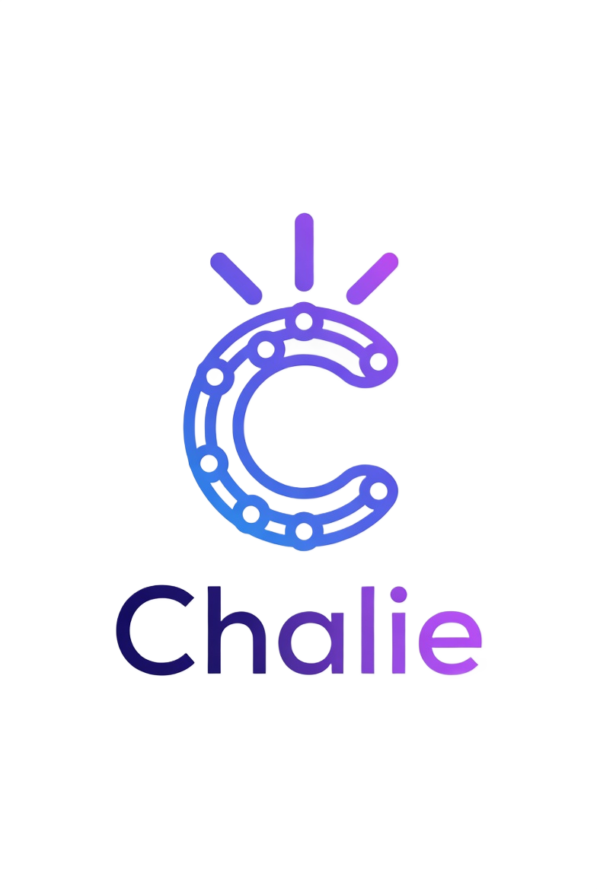
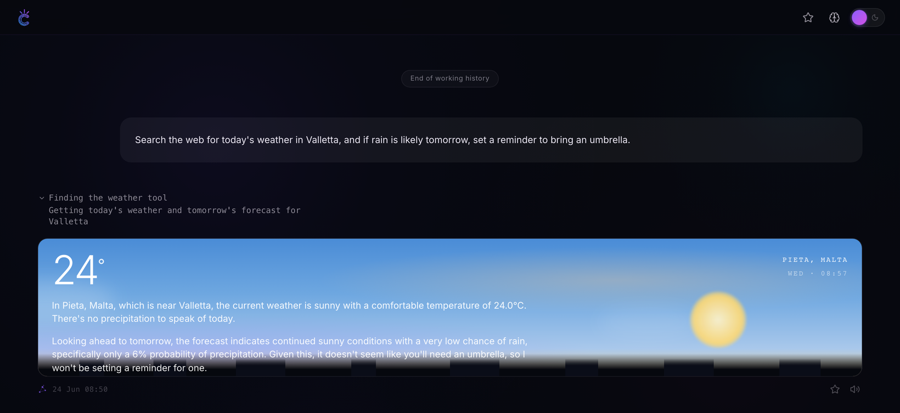

<p align="center">
  
</p>

<h1 align="center">Chalie</h1>

<p align="center">
  <strong>Life, handled.</strong><br>
  An open-source personal AI that runs on your own machine — it remembers what matters, works while you're away, and asks before it acts.
</p>

<p align="center">
  <a href="https://github.com/chalie-ai/chalie/tags"></a>
  <a href="LICENSE"></a>
  <a href="https://chalie.ai/blog/2026-06-23-ten-models-one-assistant/"></a>
  <a href="docs/04-ARCHITECTURE.md"></a>
</p>

```bash
curl -fsSL https://chalie.ai/install | bash
chalie     # → http://localhost:31025
```

> **Beta — on purpose.** It's `v1.0.0-beta` because the bar is software you'd trust with your own life's admin, and it isn't all the way there yet. Hit a sharp edge? [Open an issue](https://github.com/chalie-ai/chalie/issues) — we respond fast.

<p align="center"></p>

## Why Chalie is different

Most AI tools forget you the moment you close the tab. Chalie is a **continuous reasoning engine** that runs on your own machine: it remembers what matters and lets the rest decay, works in the background while you're away, and acts only behind an **Allow / Ask / Deny** policy spanning you, its own background work, and other agents. One SQLite file, credentials encrypted at rest, zero telemetry, encrypted whole-instance backup — no Redis, no Postgres, no queue, just one Python process.

## What it can do today

| | |
|---|---|
| 🧠 **Self-managing memory** | Episodes → concepts → abstractions, weighted by source, with decay and automatic roll-up. |
| 🎯 **Goals & proactive research** | Spots goals from casual mentions; researches topics in the background before you ask. |
| 👁 **Vision** | Reads photos, screenshots, and scans — and indexes them so you can find an image by what's in it. |
| 🌐 **Real web browsing** | Drives a live browser: clicks, fills forms, scrolls, and inspects its own screenshots. |
| 🔌 **MCP, in and out** | Connects to remote MCP servers and exposes its own tools to other agents. |
| 📬 **Email, calendar, contacts** | IMAP, CalDAV, CardDAV — the accounts you already have. |
| 🗓 **Scheduler & places** | Natural-language reminders, recurring jobs, and location-aware nudges. |
| 🐍 **Files, shell & code** | Searches files, runs guarded shell commands, executes sandboxed Python. |
| 🎙 **Voice, fully local** | Moonshine STT + Kokoro TTS, both ONNX. No cloud transcription, ever. |
| 💾 **Backup & restore** | Snapshot the whole instance to one file, optionally AES-256 encrypted. |

## Which model drives it best?

We ran ten models — frontier and open-weight — through the same battery of real tasks and scored how well each *drives* Chalie. A 31B open model you can run under your desk landed in the front pack, ahead of a 550B one. Size wasn't the story; the chassis was. → [Read the benchmark](https://chalie.ai/blog/2026-06-23-ten-models-one-assistant/)

## Install

**Fastest start** — the wizard picks your provider on first boot:
```bash
curl -fsSL https://chalie.ai/install | bash
chalie     # → http://localhost:31025 · choose OpenAI, Anthropic, Gemini, or Ollama
```

**Fully local with Ollama** — nothing leaves your network:
```bash
ollama pull gemma4:31b   # the open model that placed in the benchmark's front pack
```

**From source:**
```bash
git clone https://github.com/chalie-ai/chalie.git && cd chalie
uv pip install --system -e backend/          # core deps
uv pip install --system -e backend/[voice]   # optional: TTS/STT
./run.sh  # → http://localhost:31025/on-boarding/
```

## How it's built

One Python process. Flask + `flask-sock` WebSocket. SQLite with `sqlite-vec` and FTS5 for semantic + lexical recall. Vanilla ES6 modules on the frontend — no build step. The whole cognitive runtime — memory, goals, scheduler, voice — runs as daemon threads inside that one process, and different cognitive functions can use different models.

Curious? → [Architecture](docs/04-ARCHITECTURE.md) · [Schema](backend/schema.sql) · [Message flow](docs/13-MESSAGE-FLOW.md) · [Tools](docs/09-TOOLS.md)

## CLI

```bash
chalie                  # start
chalie --port=9000      # custom port
chalie stop             # stop the daemon
chalie update           # update to latest
chalie logs             # tail the log
```

## Philosophy

- **Judgment over activity.** Fewer high-confidence actions beat many low-confidence ones.
- **Restraint builds trust.** Every token, notification, and action earns its place.
- **Continuity is intelligence.** The persistent runtime — not any single response — is the product.
- **Constraints are features.** Decay, capacity limits, and token budgets are what make wisdom emerge.

Full product compass: [docs/00-VISION.md](docs/00-VISION.md).

## Docs & community

[Quick Start](docs/01-QUICK-START.md) · [Providers](docs/02-PROVIDERS-SETUP.md) · [Web Interface](docs/03-WEB-INTERFACE.md) · [Testing](docs/12-TESTING.md) · [FAQ](docs/FAQ.md)

[chalie.ai](https://chalie.ai) · [Releases](https://chalie.ai/releases) · [Blog](https://chalie.ai/blog) · [X](https://x.com/chalieai) · [Reddit](https://www.reddit.com/r/ChalieAi/)

## Contributing

PRs welcome. See [CONTRIBUTING.md](CONTRIBUTING.md) or [open an issue](https://github.com/chalie-ai/chalie/issues).

## License

[Apache 2.0](LICENSE) — use it, fork it, ship it.
